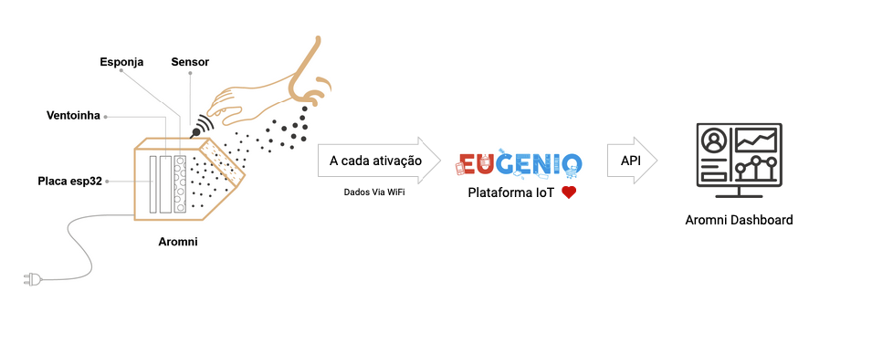
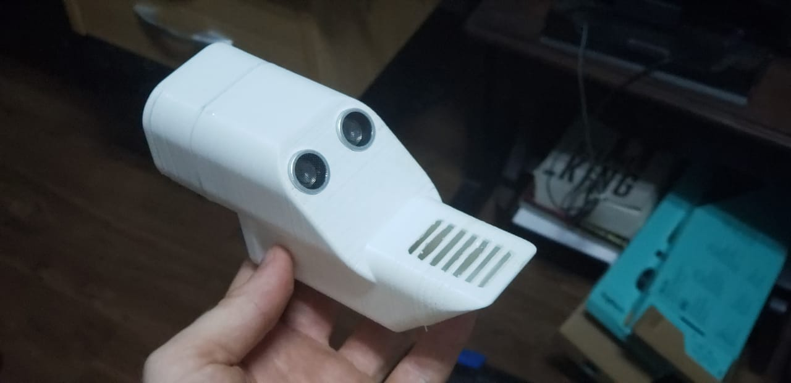

[![Forks][forks-shield]][forks-url]
[![Stargazers][stars-shield]][stars-url]
[![Issues][issues-shield]][issues-url]
[![MIT License][license-shield]][license-url]
[![LinkedIn][linkedin-shield]][linkedin-url]

 

  

  <h3 align="center">Eugenio Challenge Hub (Natura) - #TIME 15</h3>

  

    O Aromni é um dispositivo IoT que exala aromas através de um sensor de proximidade, dessa forma, livre de contatos diretos com superfícies públicas. Como uma torneira automática, basta aproximar a mão no Aromni, que ele irá exalar a essência, promovendo uma experiência olfativa no cliente.
      
    
      
    
       
    
[![Product Name Screen Shot][product-screenshot]](https://syspro.club/aromni/)
  
    <a href="https://www.syspro.club/aromni/">Ver a Dashboard</a>
    ·
    <a href="https://github.com/denisAlberto/Aromni">Hardware Repo</a>
    ·
    <a href="https://youtu.be/vj18kQQrLKg">Video Demo</a>
  

<!-- LICENSE -->
## License

Distributed under the MIT License. See `LICENSE` for more information.

<!-- CONTACT -->
## Time

<a href="https://github.com/geneuto/">@Francisco Geneuto - Desenvolvedor</a> 
<a href="https://github.com/denisAlberto/">@Denis Alberto - Desenvolver IOT</a> 
<a href="https://www.linkedin.com/in/luckmattos/">@Lucas Mattos - Ux Design</a> 
<a href="https://www.linkedin.com/in/sergiosilva-business/">@Sérgio Silva - Business</a> 
<a href="https://eueomundo.com/">@Felipe Rafael - Comunicação</a>

Dashboard Project Link: [https://github.com/geneuto/aromni](https://github.com/geneuto/aromni) 
Hardware Project Link: [https://github.com/denisAlberto/Aromni](https://github.com/denisAlberto/Aromni)

[contributors-url]: https://github.com/geneuto/aromni/graphs/contributors
[forks-shield]: https://img.shields.io/github/forks/othneildrew/Best-README-Template.svg?style=flat-square
[forks-url]: https://github.com/geneuto/aromni/network/members
[stars-shield]: https://img.shields.io/github/stars/othneildrew/Best-README-Template.svg?style=flat-square
[stars-url]: https://github.com/geneuto/aromni/stargazers
[issues-shield]: https://img.shields.io/github/issues/othneildrew/Best-README-Template.svg?style=flat-square
[issues-url]: https://github.com/geneuto/aromni/issues
[license-shield]: https://img.shields.io/github/license/othneildrew/Best-README-Template.svg?style=flat-square
[license-url]: https://github.com/geneuto/aromni/LICENSE.txt
[linkedin-shield]: https://img.shields.io/badge/-LinkedIn-black.svg?style=flat-square&logo=linkedin&colorB=555
[linkedin-url]: https://www.linkedin.com/in/francisco-geneuto-45578713a/
[product-screenshot]: template/scren_aromni01.png
